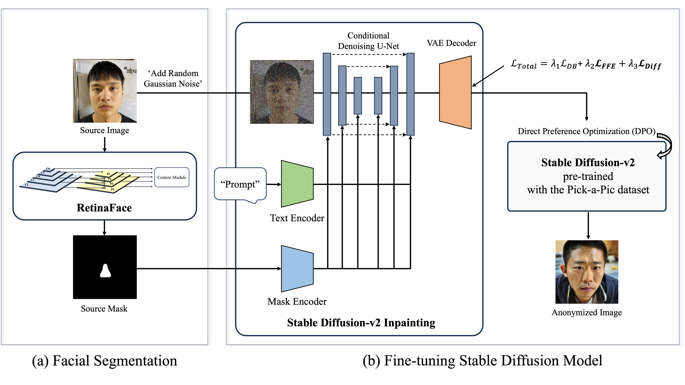

# Anonymize-Anyone
Anonymize Anyone: Toward Race Fairness in Text-to-Face Synthesis using a Diffusion Model

This repository contains the implementation of the following paper:


<be>
 
## :open_book: Overview
<!--  -->


**Anonymize Anyone** presents example results of anonymized Asian images. 

<!--  -->


We propose **Anonymize Anyone**, a text-to-face synthesis using a Diffusion Model that considers Race Fairness.
	(a) We used the facial mask from the facial segmentation model to prompt editing in specific facial regions. 
	(b) The Stable Diffusion v2 inpainting model used as our baseline, trained on the Asian dataset, and we applied **ℒ𝐹𝐹𝐸**(Focused Feature Enhancement Loss) to enhance performance even with limited data. Additionally, we used **ℒ𝑑𝑖𝑓𝑓**(Difference Loss) to address the catastrophic forgetting issue of the pre-trained model. Finally, we employed a pre-trained model trained with direct preference optimization (DPO) to produce more enhanced images. 

<br>


## :heavy_check_mark: Updates
- [03/2024] [Training code](https://github.com/dusrb37/Anonymize-Anyone) code for Anonymize Anyone released.
- [03/2024] [Inference code](https://github.com/dusrb37/Anonymize-Anyone) code for Anonymize Anyone released.

## :hammer: Setup

### 1. Environment

```bash
conda create -n anonymize python=3.10.13
conda activate anonymize

git clone https://github.com/dusrb37/Anonymize-Anyone.git
cd Anonymize-Anyone
pip install -r requirements.txt
```

### 2. Run example
```bash
python test.py
```
Find the output in `./test/anonymized`

<be>

## ⬇️: Get the Segmentation Mask

### 1. Pretrained model

1. Download the pretrained models from [Google Drive](https://drive.google.com/file/d/1lOCC3lSY_pq8v60qtfnSVzNiSirtZgsb/view?usp=drive_link).

2. Put the models under `pretrained` as follows:
    ```
    Anonymize-Anyone
    └── segmentation
        └── FaRL_jit.pt
    ```
   

### 2. Segmentation mask

Please set the environment by referring to the GitHub link. [FaRL](https://github.com/FacePerceiver/FaRL?tab=readme-ov-file) , [facer](https://github.com/FacePerceiver/facer)

```bash
python ./segmentation/test_face_segment.py
```
Find the output in `./segmentation/output`

<be>


## :running_man: Train

### 1. Train for the inpainting model
#### **Training with Focused Feature Enhancement Loss & Difference Loss**

**'Focused Feature Enhancement Loss'** is used to effectively learn detailed areas. **'Difference Loss'** enables the model to distinguish between the two classes (e.g. Asians and Caucasians) and preserve their respective. For difference loss, we first generate images using the model with a difference prompt and then use those during training along with our data. Refer to the paper to learn more about it.

___Note: It needs at least 24GB VRAM.___


```bash
export MODEL_NAME="stabilityai/stable-diffusion-2-inpainting"
export INSTANCE_DIR="path-to-instance-images"
export DIFFERENCE_DIR="path-to-difference-images"
export OUTPUT_DIR="path-to-save-model"

accelerate launch ./train_anonymize_inpaint.py \
  --pretrained_model_name_or_path=$MODEL_NAME  \
  --train_text_encoder \
  --instance_data_dir=$INSTANCE_DIR \
  --difference_data_dir=$DIFFERENCE_DIR \
  --output_dir=$OUTPUT_DIR \
  --ffel_weight=0.01 \
  --threshold=0.5 \
  --with_difference_loss \
  --instance_prompt="a photo of asian" \
  --difference_prompt="a photo of white man" \
  --resolution=512 \
  --train_batch_size=1 \
  --use_8bit_adam \
  --gradient_checkpointing \
  --learning_rate=1e-6 \
  --lr_scheduler="constant" \
  --lr_warmup_steps=0 \
  --num_difference_images=300 \
  --max_train_steps=10000 \
```

### **Important Args**

#### **General**

- `--pretrained_model_name_or_path` what model to train/initalize from
- `--INSTANCE_DIR` path for dataset that you want to train
- `--DIFFERENCE_DIR` path-for difference images
- `--output_dir` where to save/log to
- `--instance_prompt` prompt that you want to train
- `--train_text_encoder` Fine-tuning `text_encoder` with `unet` can give much better results, especially for faces

#### **Loss**

- `--ffel_weight` Focused Feature Enhancement Loss
- `--threshold` Parameter for critical feature mask, It is recommended to experiment by adjusting it up or down from 0.5
- `--with_difference_loss` Difference Loss
- `--difference_prompt` prompt that you want to preserve
- `--num_difference_images` Number of generating images for difference prompt, 200-300 worked well for our cases


### 2. Train for DPO

Run the shell script below for training DPO. 
Please refer to the original [code base repository](https://github.com/SalesforceAIResearch/DiffusionDPO) and change the settings accordingly. We used [pre-trained model](https://huggingface.co/radames/sd-21-DPO-LoRA).
```bash
./tarin_dpo_diffusion.sh
```

<be>

## ✈️ Inference

To inference your dataset, change the path of the image and mask.
```bash
python inference.py
```
<be>
   
## ❤️ Acknowledgement

We thank the authors for their great work. 
- We were heavily inspired by [DreamBooth](https://arxiv.org/abs/2208.12242) for how train effectively with a small dataset and [DiffusionDPO](https://arxiv.org/abs/2311.12908) for how optimize human preferences into diffusion model.
- Our training pipeline was modified from the [the diffusers library](https://github.com/huggingface/diffusers).
